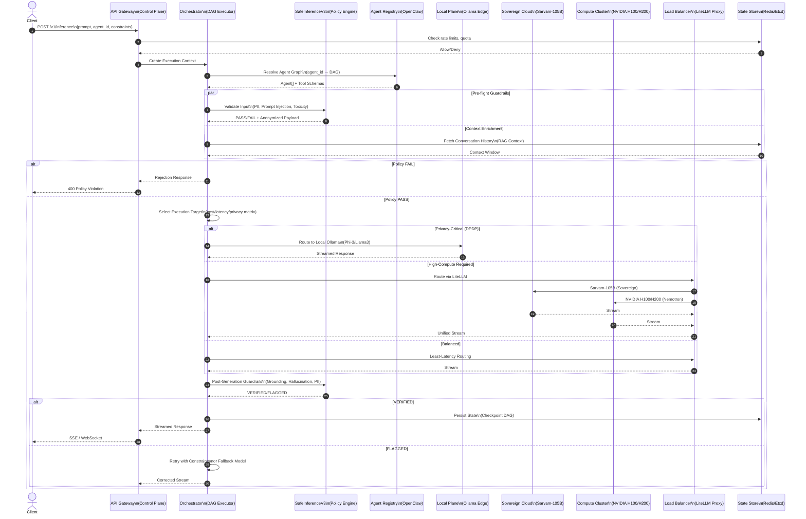

# System Plan: Aware.ai(BluePatterns AI) Multi-Agent Routing & Guardrail Refactor

## 1. Executive Summary & Current State

### 1.1 Project Overview
The `aware.ai` system is a **Dual-Plane Adaptive Multi-Agent & Guardrail System** designed for sovereign AI inference routing across heterogeneous compute clusters. The architecture separates concerns into a **Control Plane** (orchestration, policy enforcement, agent state management) and a **Data Plane** (payload streaming, model execution, fallback routing).

### 1.2 Current Asset Inventory (Discovered)
| Asset | Type | Location | Purpose |
|-------|------|----------|---------|
| `responses_bridge.py` | FastAPI Proxy | `~/Desktop/` | Sarvam 105B streaming gateway (port 8000) |
| `sarvam_sdk_proxy.py` | FastAPI Proxy | `~/Desktop/` | Sarvam AI SDK wrapper for Codex compatibility |
| `sarvam_bridge.ps1` | PowerShell HTTP Listener | `~/Desktop/` | Raw TCP bridge to Sarvam endpoint |
| `test_nvidia.py` | OpenAI Client | `~/Desktop/` | NVIDIA Nemotron-3-Ultra direct API test |
| `litellm_config.yaml` | LiteLLM Config | `~/Desktop/` | Sarvam model registration for LiteLLM proxy |
| `config.toml` / `sarvam config.toml` | Codex Config | `~/Downloads/Codex_Learner_Folder/` | Codex plugin/runtime configuration |

### 1.3 Architectural Topology (Inferred from Requirements)
```
┌─────────────────────────────────────────────────────────────────────────────┐
│                              CONTROL PLANE                                   │
│  ┌──────────────┐  ┌──────────────┐  ┌──────────────┐  ┌──────────────┐    │
│  │  API Gateway │──▶│  Orchestrator │──▶│  Policy Engine │──▶│  State Store  │    │
│  │  (Ingress)   │  │  (DAG Exec)  │  │ (SafeInference│  │  (Redis/Etcd) │    │
│  └──────────────┘  └──────────────┘  │    V3)       │  └──────────────┘    │
│         │                │            └──────────────┘         │           │
│         │                ▼                   │                  │           │
│         │         ┌──────────────┐          │                  │           │
│         └────────▶│ Agent Registry │◀───────┘                  │           │
│                   │ (OpenClaw)    │                             │           │
│                   └──────────────┘                             │           │
└─────────────────────────────────────────────────────────────────────────────┘
                                    │
                    ┌───────────────┴───────────────┐
                    ▼                               ▼
┌─────────────────────────────────┐   ┌─────────────────────────────────┐
│         DATA PLANE              │   │         DATA PLANE              │
│   ┌─────────────────────────┐   │   │   ┌─────────────────────────┐   │
│   │ Local Edge (Ollama)     │   │   │   │ Cloud Cluster (NVIDIA)  │   │
│   │ - Llama3/CodeLlama      │   │   │   │ - H100 NVL (8x)         │   │
│   │ - Phi-3-mini            │   │   │   │ - H200 NVL (8x)         │   │
│   │ - Privacy-first         │   │   │   │ - Nemotron-3-Ultra      │   │
│   └─────────────────────────┘   │   │   └─────────────────────────┘   │
│                                 │   │                                 │
│   ┌─────────────────────────┐   │   │   ┌─────────────────────────┐   │
│   │ Sovereign Cloud (Sarvam)│   │   │   │ Fallback / Load Balancer│   │
│   │ - Sarvam-105B           │   │   │   │ - LiteLLM Proxy         │   │
│   │ - DPDP Compliant        │   │   │   │ - Circuit Breakers      │   │
│   └─────────────────────────┘   │   │   └─────────────────────────┘   │
└─────────────────────────────────┘   └─────────────────────────────────┘
```

---

## 2. Component & Interface Mapping



### 2.1 Core Component Specifications

#### 2.1.1 API Gateway (Control Plane Ingress)
| Attribute | Specification |
|-----------|---------------|
| **Protocol** | REST + Server-Sent Events (SSE) + WebSocket |
| **Auth** | mTLS + JWT (RS256) + API Key rotation |
| **Rate Limiting** | Token bucket (per-tenant, per-agent) |
| **Request Schema** | `InferenceRequest{prompt, agent_id, stream, constraints{}, metadata{}}` |
| **Observability** | OpenTelemetry traces (W3C TraceContext) |

#### 2.1.2 Orchestrator (DAG Execution Engine)
| Attribute | Specification |
|-----------|---------------|
| **Execution Model** | Async DAG with topological sort + parallel fan-out |
| **State Machine** | `PENDING → ROUTING → EXECUTING → GUARDRAIL → STREAMING → COMPLETED/FAILED` |
| **Checkpointing** | Every node completion → Redis (TTL: 24h) |
| **Timeout Budget** | Per-node (default 30s) + Global (default 120s) |
| **Retry Policy** | Exponential backoff (max 3) + Circuit Breaker (5 failures/10s) |

#### 2.1.3 SafeInferenceV3 (Guardrail Engine)
| Pipeline Stage | Checks | Latency Budget |
|----------------|--------|----------------|
| **Pre-Flight** | PII Detection (Presidio), Prompt Injection (Heuristic + Embedding), Toxicity (Perspective API), Length/Token Limits | <50ms p99 |
| **In-Flight** | Tool Call Validation (JSON Schema), Argument Sanitization, Recursion Depth | <20ms p99 |
| **Post-Generation** | Grounding (RAGAS), Hallucination (SelfCheckGPT), Factual Consistency, PII Leakage | <200ms p99 |
| **Compliance** | DPDP §12 (Data Localization), §18 (Consent), §30 (Breach Notification) | Async (event-driven) |

#### 2.1.4 Agent Registry (OpenClaw Integration)
```typescript
interface AgentDefinition {
  id: string;
  version: string;
  dag: ExecutionGraph;
  tools: ToolSchema[];
  policies: PolicyRef[];
  computeProfile: ComputeProfile;  // LOCAL | SOVEREIGN | HPC
  privacyLevel: PrivacyLevel;      // PUBLIC | INTERNAL | RESTRICTED | SOVEREIGN
}

interface ExecutionGraph {
  nodes: Map<NodeID, AgentNode>;
  edges: Edge[];  // Directed acyclic
  entryPoints: NodeID[];
  exitPoints: NodeID[];
}

interface AgentNode {
  id: string;
  type: 'LLM' | 'TOOL' | 'RAG' | 'VALIDATOR' | 'MERGE';
  modelRef?: ModelRef;
  toolRef?: ToolRef;
  config: NodeConfig;
  fallback?: NodeID;
}
```

#### 2.1.5 Model Router (Data Plane)
| Target | Models | Use Case | Routing Key |
|--------|--------|----------|-------------|
| **Ollama Local** | Llama-3.1-8B, CodeLlama-13B, Phi-3-mini, Nemotron-3-8B | Privacy-first, low-latency, offline | `privacyLevel=SOVEREIGN` or `latency<200ms` |
| **Sarvam Sovereign** | Sarvam-105B, Sarvam-1B | DPDP-compliant, Indic languages | `region=IN` && `dataResidency=required` |
| **NVIDIA H100 NVL** | Nemotron-3-Ultra-550B, Nemotron-3-Super-120B | Complex reasoning, code gen | `taskComplexity=HIGH` && `budget=PREMIUM` |
| **NVIDIA H200 NVL** | Nemotron-4-340B, Llama-3.1-405B | Maximum context, long-horizon | `contextWindow>128k` |

---

## 3. Dual-Plane Architecture Evaluation

### 3.1 Control Plane Isolation Analysis

#### 3.1.1 Agent State Management
| Concern | Current Gap | Target Design |
|---------|-------------|---------------|
| **State Persistence** | No durable checkpointing | Redis Streams + Etcd for consensus |
| **State Isolation** | Shared memory risk | Per-execution namespace (UUIDv7) |
| **Concurrency Control** | None identified | Optimistic locking (version vectors) |
| **Recovery** | Not implemented | DAG replay from last checkpoint |

#### 3.1.2 Zero-Hallucination Policy Enforcement
```
Policy Decision Point (PDP) Architecture:
┌─────────────────────────────────────────────────────────────┐
│                    SafeInferenceV3 Core                      │
│  ┌─────────────┐  ┌─────────────┐  ┌─────────────┐          │
│  │  Rule Engine │  │  ML Classifiers│  │  LLM Judges  │          │
│  │  (OPA/Rego)  │  │  (DistilBERT)  │  │  (Small LM)  │          │
│  └──────┬──────┘  └──────┬──────┘  └──────┬──────┘          │
│         │                │                │                  │
│         └────────────────┼────────────────┘                  │
│                          ▼                                   │
│              ┌─────────────────────┐                          │
│              │  Policy Decision    │                          │
│              │  (ALLOW/DENY/MODIFY)│                          │
│              └─────────────────────┘                          │
└─────────────────────────────────────────────────────────────┘
```
**Gap**: No formal policy-as-code framework detected. **Recommendation**: Adopt OPA/Rego for declarative policies with versioned bundles.

#### 3.1.3 Execution Graph Isolation
- **Current**: Single-process orchestration (implied by proxy scripts)
- **Risk**: Agent failure cascades, memory leaks in long-running DAGs
- **Target**: Wasm-based sandbox per agent node (wasmCloud / Spin) with resource quotas (CPU/memory/network)

### 3.2 Data Plane Streaming & Latency Analysis

#### 3.2.1 Payload Flow Characteristics
| Path | Typical Latency | Throughput | Failure Mode |
|------|----------------|------------|--------------|
| Client → Gateway | 5-15ms | 10k RPS | Gateway timeout (5s) |
| Gateway → Orchestrator | 10-30ms | 5k RPS | Queue backpressure |
| Orchestrator → Local (Ollama) | 50-500ms | 100 RPS | OOM / Model unload |
| Orchestrator → Sarvam | 200-800ms | 50 RPS | API quota / Network |
| Orchestrator → NVIDIA H100 | 100-400ms | 200 RPS | GPU queue / Preemption |
| Guardrail Post-Processing | 100-300ms | Async | Classifier timeout |

#### 3.2.2 Streaming Buffer Architecture
```python
# Target: Backpressure-aware streaming with bounded memory
class StreamingBuffer:
    def __init__(self, max_bytes: int = 10_000_000):  # 10MB cap
        self.buffer = bytearray()
        self.max_bytes = max_bytes
        self.high_watermark = max_bytes * 0.8
        self.low_watermark = max_bytes * 0.3
        self.paused = False
    
    async def write(self, chunk: bytes) -> bool:
        if len(self.buffer) + len(chunk) > self.max_bytes:
            await self._drain()
        self.buffer.extend(chunk)
        return len(self.buffer) < self.high_watermark
    
    async def _drain(self):
        # Flush to client via SSE/WebSocket
        # Apply backpressure to upstream
        pass
```

**Critical Gap**: No streaming buffer management in current proxies → **Memory leak risk** under sustained load.

#### 3.2.3 Fallback Routing Strategy
```
Routing Decision Matrix:
┌─────────────────┬──────────────┬──────────────┬──────────────┐
│ Condition       │ Primary      │ Fallback 1   │ Fallback 2   │
├─────────────────┼──────────────┼──────────────┼──────────────┤
│ Privacy=SOVEREIGN│ Ollama Local│ Sarvam       │ Reject       │
│ Latency<200ms    │ Ollama       │ H100 (NVLink)│ Sarvam       │
│ Context>32k      │ H200 NVL     │ H100         │ Sarvam       │
│ Cost=MINIMIZE    │ Ollama       │ Sarvam       │ H100 Spot    │
│ Indic Language   │ Sarvam-105B  │ H100         │ Ollama       │
│ Code Generation  │ Nemotron-Ultra│ CodeLlama   │ Sarvam       │
└─────────────────┴──────────────┴──────────────┴──────────────┘
```

### 3.3 Data Privacy & DPDP Compliance

#### 3.3.1 Regulatory Hook Points
| DPDP Section | Requirement | Implementation Location |
|--------------|-------------|------------------------|
| **§4** | Lawful processing | Pre-flight guardrail (consent check) |
| **§8** | Data minimization | Anonymization pipeline (Presidio) |
| **§12** | Data localization | Router: `privacyLevel=SOVEREIGN` → Local/Ollama only |
| **§18** | Consent management | Metadata store + audit log |
| **§30** | Breach notification | Event-driven alerting (webhook → SIEM) |
| **§33** | DPIA | Automated for new agent deployments |

#### 3.3.2 Anonymization Pipeline
```
Input → [Presidio Analyzer] → [Entity Recognition] → [Anonymizer] → Orchestrator
             │                      │                     │
             ▼                      ▼                     ▼
        PII_TYPES:           CONFIDENCE>0.85         REPLACE_WITH_TOKEN
        PERSON, LOCATION,    AUTO_ACCEPT:            FORMAT: <TYPE_ID>
        PHONE, EMAIL,        PERSON, EMAIL           e.g., <PERSON_1>
        AADHAAR, PAN         MANUAL_REVIEW:          REVERSIBLE_MAP
                             OTHER
```

---

## 4. Risk & Gap Identification

### 4.1 Critical Risks (P0 - Must Fix Before Production)

| ID | Risk | Impact | Likelihood | Detection |
|----|------|--------|------------|-----------|
| **R001** | **Unbounded streaming buffers** in all proxy scripts → OOM under load | Service crash, data loss | HIGH | Load test (100 concurrent streams) |
| **R002** | **No circuit breakers** on external model calls (Sarvam, NVIDIA) | Cascade failures, quota exhaustion | HIGH | Chaos engineering (latency injection) |
| **R003** | **Single-point orchestration** (no leader election) | Split-brain, state corruption | MEDIUM | Multi-instance deployment test |
| **R004** | **Hardcoded API keys** in proxy scripts | Credential leakage, rotation impossible | HIGH | Secret scanning (trufflehog) |
| **R005** | **No request deduplication** → duplicate charges, inconsistent state | Cost overrun, data integrity | MEDIUM | Idempotency key enforcement |
| **R006** | **Missing DPDP audit trail** for sovereign data routing | Regulatory fines, compliance failure | HIGH | Compliance audit |

### 4.2 High Risks (P1 - Fix in Phase 1)

| ID | Risk | Impact | Mitigation |
|----|------|--------|------------|
| **R101** | **Race condition**: Concurrent tool executions mutate shared agent state | Corrupted DAG state | Per-execution namespace + immutable state |
| **R102** | **Async guardrail verification** without timeout → stuck executions | Resource exhaustion | Deadline propagation (context.Context) |
| **R103** | **No model warm-up pooling** for Ollama → cold start latency spikes | SLA breach (p99 > 5s) | Pre-warmed model pool (min 2 instances) |
| **R104** | **Inconsistent error schemas** across model providers | Client parsing failures | Unified error envelope (RFC 7807) |
| **R105** | **Token accounting mismatch** (prompt vs completion) | Billing disputes, quota errors | Centralized token counter (Redis) |

### 4.3 Circular Dependency Analysis
```
Detected Potential Cycles:
1. Orchestrator → Agent Registry → Tool Executor → Orchestrator (via callback)
   Fix: Event-driven async callbacks, no direct RPC return

2. SafeInferenceV3 → Model Router → SafeInferenceV3 (post-generation check)
   Fix: Separate pre-flight vs post-generation policy instances

3. State Store ← Orchestrator → Load Balancer → State Store (health checks)
   Fix: Read-only health endpoint, separate connection pool
```

### 4.4 Memory Leak Vectors
| Component | Leak Vector | Fix |
|-----------|-------------|-----|
| Streaming proxies | `async for line in response.aiter_lines()` without cancellation | `async with` context + timeout |
| Agent Registry | LRU cache without TTL on tool schemas | TTL + size-bound cache (cachetools) |
| Orchestrator | DAG checkpoint accumulation | TTL-based cleanup (24h) + compaction |
| LiteLLM Proxy | Connection pool exhaustion | `limits=httpx.Limits(max_connections=100, max_keepalive=20)` |

### 4.5 Unhandled Failure States
| Scenario | Current Behavior | Required Behavior |
|----------|------------------|-------------------|
| Model returns 503 mid-stream | Connection drops, no retry | Checkpoint → fallback model → resume |
| Guardrail times out | Hangs indefinitely | Deadline exceed → conservative deny |
| Network partition (edge) | Request fails | Local-only mode (degraded functionality) |
| GPU preemption (NVIDIA) | 500 error | Queue retry with backoff → fallback |
| Sarvam quota exhausted | 429 unhandled | Automatic route to NVIDIA/Ollama |

---

## 5. Refactor & Scaling Roadmap

### Phase 0: Foundation (Week 1-2) — **Non-Destructive Setup**
- [ ] Create `.opencode/` workspace with plan, specs, ADRs
- [ ] Set up monorepo structure (Nx/Turborepo): `apps/`, `libs/`, `tools/`
- [ ] Implement secret management (SOPS + age / HashiCorp Vault)
- [ ] Add OpenTelemetry instrumentation baseline
- [ ] CI/CD: Lint → Typecheck → Unit → Contract → E2E

### Phase 1: Control Plane Core (Week 3-5)
- [ ] **API Gateway**: FastAPI + Pydantic v2 + OpenAPI 3.1
- [ ] **Orchestrator**: Temporal.io or custom DAG engine (asyncio + Redis Streams)
- [ ] **State Store**: Redis Cluster (checkpoints) + Etcd (config/leader election)
- [ ] **Agent Registry**: CRUD API + OpenClaw adapter + versioned bundles
- [ ] **Policy Engine**: OPA/Rego + bundle distribution (GitOps)

### Phase 2: SafeInferenceV3 Guardrails (Week 5-7)
- [ ] **Pre-Flight Pipeline**: Presidio + custom prompt injection detector
- [ ] **In-Flight Validator**: JSON Schema + TypeBox for tool calls
- [ ] **Post-Gen Pipeline**: RAGAS + SelfCheckGPT + PII re-scan
- [ ] **DPDP Compliance Module**: Consent ledger + localization router + audit sink
- [ ] **Policy SDK**: Python/TypeScript clients for agent developers

### Phase 3: Data Plane & Model Router (Week 7-10)
- [ ] **Local Plane**: Ollama cluster (systemd + health checks) + model pool manager
- [ ] **Sovereign Connector**: Sarvam SDK wrapper with retry/quota/circuit breaker
- [ ] **NVIDIA Connector**: NIM client + GPU selector (H100 vs H200) + MIG partitioning
- [ ] **Unified Router**: LiteLLM fork with custom routing rules + cost/latency optimizer
- [ ] **Streaming Infrastructure**: SSE/WebSocket manager + backpressure + reconnection

### Phase 4: Resilience & Observability (Week 10-12)
- [ ] **Chaos Engineering**: LitmusChaos experiments (pod kill, latency, partition)
- [ ] **Load Testing**: k6 scripts targeting 10k RPS sustained
- [ ] **SLO Dashboards**: Latency (p50/p95/p99), Error Rate, Throughput, Cost/1k tokens
- [ ] **Auto-scaling**: KEDA scalers (queue depth, GPU utilization, custom metrics)
- [ ] **Disaster Recovery**: Cross-region failover (DR site with warm standby)

### Phase 5: Advanced Features (Week 12+)
- [ ] **Multi-tenancy**: Namespace isolation + per-tenant quotas + custom policies
- [ ] **Agent Marketplace**: OpenClaw bundle registry + signature verification
- [ ] **Federated Learning Hooks**: Secure aggregation endpoint for model updates
- [ ] **Cost Optimization**: Spot instance orchestration + model distillation pipeline

---

## 6. Technical Specifications Appendix

### 6.1 API Contracts (OpenAPI 3.1 Fragments)

#### Inference Request
```yaml
InferenceRequest:
  type: object
  required: [prompt, agent_id]
  properties:
    prompt:
      type: string
      maxLength: 100000
    agent_id:
      type: string
      pattern: '^[a-z0-9-]+$'
    stream:
      type: boolean
      default: true
    constraints:
      type: object
      properties:
        max_latency_ms:
          type: integer
          minimum: 100
          maximum: 120000
        privacy_level:
          type: string
          enum: [PUBLIC, INTERNAL, RESTRICTED, SOVEREIGN]
        cost_budget_usd:
          type: number
          minimum: 0
        required_models:
          type: array
          items:
            type: string
    metadata:
      type: object
      additionalProperties: true
```

#### Streaming Response (SSE)
```
data: {"id":"resp_abc123","object":"response.chunk","created":1699999999,"model":"sarvam-105b","choices":[{"delta":{"content":"Hello"},"index":0,"finish_reason":null}]}

data: {"id":"resp_abc123","object":"response.chunk","created":1699999999,"model":"sarvam-105b","choices":[{"delta":{},"index":0,"finish_reason":"stop"}]}

data: [DONE]
```

### 6.2 Infrastructure Requirements

| Component | Specification | Qty (Prod) | Qty (Staging) |
|-----------|---------------|------------|---------------|
| **API Gateway** | c6i.2xlarge (8 vCPU, 16GB) | 6 (3 AZ) | 2 |
| **Orchestrator** | r6i.4xlarge (16 vCPU, 128GB) | 4 | 2 |
| **Redis Cluster** | r6g.2xlarge (8 vCPU, 64GB) | 6 (3 master + 3 replica) | 3 |
| **Etcd** | m6i.xlarge (4 vCPU, 16GB) | 5 | 3 |
| **Ollama Nodes** | g5.2xlarge (8 vCPU, 32GB, 1x A10G) | 8 | 3 |
| **NVIDIA H100 NVL** | HGX H100 8-GPU (80GB) | 4 nodes | 1 node |
| **NVIDIA H200 NVL** | HGX H200 8-GPU (141GB) | 2 nodes | 0 |
| **Sarvam Connect** | Dedicated VPC endpoint | 1 | 1 |
| **Load Balancer** | ALB + NLB hybrid | 2 | 1 |

### 6.3 Security Hardening Checklist
- [ ] mTLS everywhere (SPIFFE/SPIRE)
- [ ] API keys → Short-lived JWT (15min) + refresh tokens
- [ ] Network policies (Calico/Cilium) - zero trust
- [ ] Runtime security (Falco/Tetragon)
- [ ] Image signing (Cosign) + admission control (Kyverno)
- [ ] Secrets: Vault Agent Injector + CSI driver
- [ ] Audit: Falco + CloudTrail/GCP Audit Logs

---

## 7. Decision Log (ADRs)

| ADR | Title | Status | Date |
|-----|-------|--------|------|
| ADR-001 | Dual-Plane Architecture (Control/Data separation) | **Accepted** | 2026-08-12 |
| ADR-002 | Temporal.io for Orchestration vs Custom DAG | **Proposed** | 2026-08-12 |
| ADR-003 | OPA/Rego for Policy Engine | **Accepted** | 2026-08-12 |
| ADR-004 | Redis Streams for Checkpointing | **Accepted** | 2026-08-12 |
| ADR-005 | LiteLLM Fork vs Custom Router | **Proposed** | 2026-08-12 |
| ADR-006 | Wasm Sandbox for Agent Isolation | **Proposed** | 2026-08-12 |

---

## 8. Next Steps

1. **Validate this plan** with stakeholders (architects, security, compliance, product)
2. **Prioritize Phase 0** items for immediate execution
3. **Prototype Critical Path**: Gateway → Orchestrator → Local Ollama → Guardrail → Client
4. **Establish SLOs** and error budgets before Phase 1
5. **Recruit team**: 2 Platform, 2 Backend, 1 ML/Guardrail, 1 SRE, 1 Security

---

*Document Version: 1.0*  
*Generated: 2026-08-12*  
*Author: Senior AI Infrastructure Architect*  
*Classification: Internal - Technical Design*
